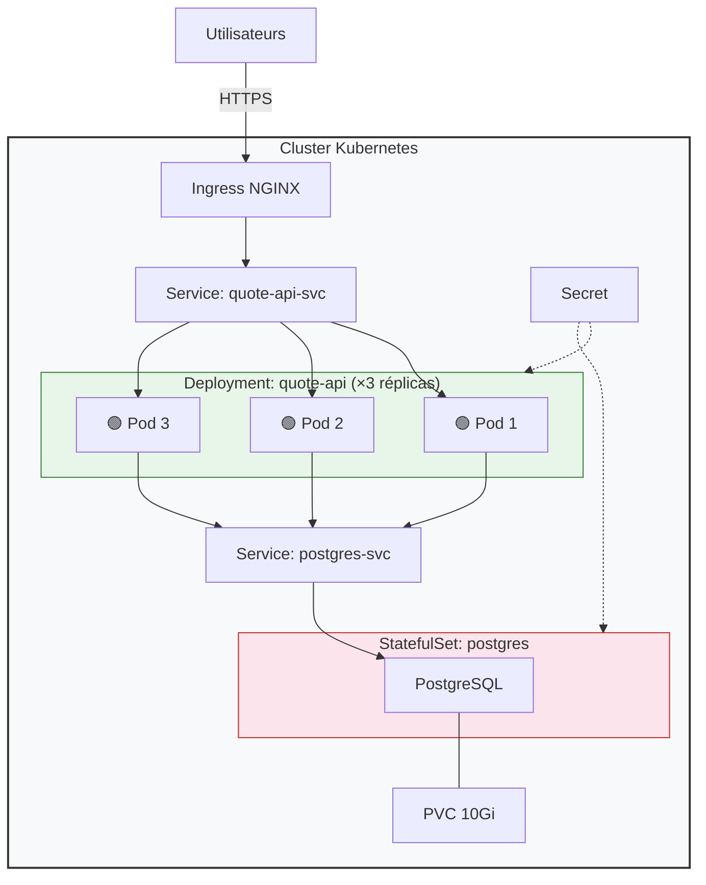

# RES507 — Lab 95 : Défi final des systèmes

---

## Current System Problems

### Problème 1 — Pod unique = Point de défaillance unique (SPOF)

L'ensemble du système repose sur un seul Pod qui contient à la fois l'API et PostgreSQL dans le même conteneur. Si ce Pod tombe, **tout** tombe : l'application ET les données.

**important ?**
En production, un Pod peut être tué à tout moment (OOM, crash node, mise à jour…). Sans réplicas, il y a **zéro disponibilité** pendant la recréation du Pod.

**Risques :**
- Downtime complet à chaque redémarrage
- Perte de données si le conteneur est recréé (pas de PersistentVolume)
- Impossibilité de faire un Rolling Update (1 seul Pod = coupure obligatoire)

---

### Problème 2 — Aucune sonde de santé (Probes)

Il n'y a ni `livenessProbe` ni `readinessProbe`. Kubernetes ne sait pas si l'application fonctionne ou est bloquée.

**important ?**
Sans probes, Kubernetes continue d'envoyer du trafic à un Pod qui pourrait être en deadlock ou en erreur 500 en boucle. Il ne le redémarrera jamais automatiquement.

**Risques :**
- Trafic envoyé vers un Pod "zombie" → erreurs utilisateurs
- Aucune auto-guérison : le Pod reste en état broken indéfiniment
- Les Rolling Updates ne savent pas si le nouveau Pod est prêt

---

### Problème 3 — Secrets en texte clair

Les identifiants PostgreSQL (user, password, host) sont stockés comme variables d'environnement en clair dans le manifeste YAML du Deployment.

**important ?**
Quiconque a accès au repo Git ou peut faire un `kubectl describe pod` voit les mots de passe en clair.

**Risques :**
- Fuite de credentials dans le dépôt Git
- Violation de conformité sécurité
- Accès non autorisé à la base de données

---

### Problème 4 — Aucune limite de ressources

**Quel est le problème ?**
Aucun `requests` ni `limits` CPU/RAM n'est défini sur le Pod.

**important ?**
Un Pod sans limites peut consommer toutes les ressources du nœud, provoquant l'éviction d'autres Pods ou le crash du nœud entier.

**Risques :**
- Un memory leak dans l'API peut tuer le nœud complet
- Le scheduler Kubernetes ne peut pas placer intelligemment les Pods
- Aucune garantie de QoS (Quality of Service)

---

### Problème 5 — App et DB couplées dans le même conteneur

PostgreSQL tourne dans le même conteneur que l'API. Impossible de les scaler, mettre à jour ou redémarrer indépendamment.

**important**
C'est un anti-pattern fondamental en architecture conteneurs. Un conteneur = un processus = une responsabilité.

**Risques :**
- Impossible de scaler l'API sans dupliquer la DB
- Un crash de PostgreSQL tue l'API (et vice versa)
- Pas de stratégie de backup indépendante

---

## Production Architecture

### Vue d'ensemble

L'architecture de production sépare les responsabilités en composants indépendants :

```
Utilisateurs → Ingress (NGINX) → Service API → Deployment API (3 réplicas) → Service DB → StatefulSet PostgreSQL → PersistentVolumeClaim
```

### Diagramme d'architecture



### Composants clés de la refonte

| Composant | Avant (Broken) | Après (Production) |
|---|---|---|
| **App** | 1 Pod, couplé avec DB | Deployment 3 réplicas, indépendant |
| **DB** | Dans le même conteneur | StatefulSet séparé + PVC |
| **Probes** | Aucune | Liveness + Readiness sur chaque Pod |
| **Secrets** | Env vars en clair | Kubernetes Secret (base64) |
| **Ressources** | Aucune limite | Requests + Limits CPU/RAM |
| **Déploiement** | Remplacement brutal | RollingUpdate (zero-downtime) |
| **Exposition** | NodePort basique | Ingress NGINX + TLS |
| **Stockage** | Éphémère (perdu au restart) | PersistentVolumeClaim 10Gi |

---

## Operational Strategy

### Comment on scale  ?

L'API utilise un **Deployment avec 3 réplicas**. Pour absorber plus de trafic :

1. **Scale horizontal** : `kubectl scale deployment quote-api --replicas=5` — immédiat
2. **HPA** : Un HorizontalPodAutoscaler peut ajuster automatiquement le nombre de réplicas en fonction du CPU ou du nombre de requêtes
3. La base de données reste en **1 réplica**.

### Comment les mises à jour sont déployées ?

Stratégie **RollingUpdate** avec :
- `maxSurge: 1` → crée 1 nouveau Pod avant de tuer l'ancien
- `maxUnavailable: 0` → jamais moins de 3 Pods disponibles pendant l'update

**Flux concret :**
1. On push une nouvelle image `quote-api:v3`
2. Kubernetes crée un Pod v3 supplémentaire
3. Il attend que la `readinessProbe` du nouveau Pod passe 
4. Il termine un Pod v2
5. Répète jusqu'à ce que tous les Pods soient en v3
6. **Résultat : zéro coupure de service**

### Comment les pannes sont détectées ?

| Sonde | Rôle | Action si échec |
|---|---|---|
| `livenessProbe` | "Le process est-il vivant ?" | Kubernetes **redémarre** le conteneur |
| `readinessProbe` | "Le Pod peut-il servir du trafic ?" | Kubernetes le **retire du Service** (plus de trafic) |

Exemple concret  du tp précédent :
```yaml
livenessProbe:
  httpGet:
    path: /health
    port: 8080
  initialDelaySeconds: 10
  periodSeconds: 5

readinessProbe:
  httpGet:
    path: /ready
    port: 8080
  initialDelaySeconds: 5
  periodSeconds: 3
```

### Quels contrôleurs gèrent la récupération ?

| Contrôleur | Responsabilité |
|---|---|
| **ReplicaSet** (via Deployment) | Maintient toujours 3 Pods API en vie. Si un Pod meurt → en recrée un |
| **StatefulSet** | Maintient le Pod PostgreSQL et garantit l'attachement au même PVC |
| **Endpoint Controller** | Met à jour la liste des Pods sains derrière le Service |
| **Node Controller** | Détecte si un nœud tombe et re-schedule les Pods ailleurs |


## Weakest Point

### Le Single Point of Failure restant : PostgreSQL

Malgré toutes les améliorations, **la base de données PostgreSQL reste en 1 seul réplica**. C'est le maillon faible de cette architecture.

**Pourquoi ?**
- Si le Pod postgres-0 crash, il y a une **brève interruption** le temps que le StatefulSet le recrée
- Les données sont persistées (PVC), donc pas de perte, mais il y a un **downtime DB**
- Pendant ce temps, les 3 Pods API retournent des erreurs 500 (ils ne peuvent plus accéder à la DB)

**Solutions futures  :**
- Backups automatisés avec un CronJob
- Read-replicas pour distribuer la charge de lecture

## Réflexion optionnelle

**Trafic ×10 — Qu'est-ce qui cède en premier ?**
PostgreSQL. Un seul Pod DB ne peut pas absorber 10× les connexions

**Quels signaux surveiller en premier ?**
- Utilisation CPU/RAM des Pods
- Latence des requêtes API (p95, p99)
- Nombre de connexions actives PostgreSQL
- Taux d'erreurs 5xx sur l'Ingress

**Déploiement multi-nœuds/régions ?**
Utiliser des `podAntiAffinity` pour répartir les Pods API sur différents nœuds. Pour le multi-région : un cluster par région avec une DB répliquée et un Global Load Balancer.

**Quand utiliser des VMs plutôt que des conteneurs ?**
PostgreSQL en production critique bénéficie souvent d'une VM dédiée pour un contrôle fin du stockage (IOPS, latence disque) et éviter le "noisy neighbor" des conteneurs.